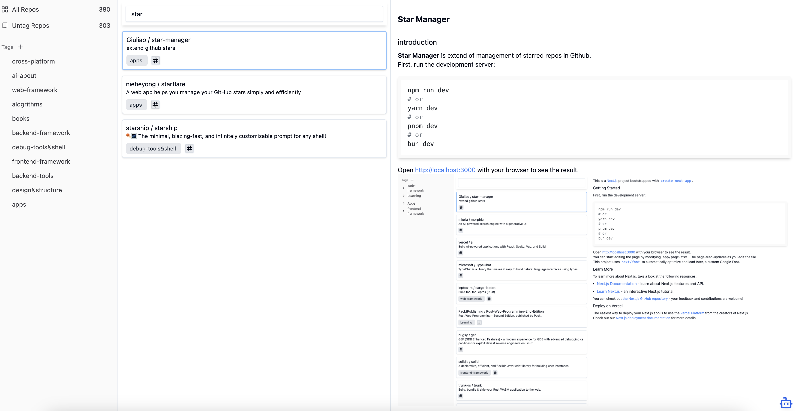
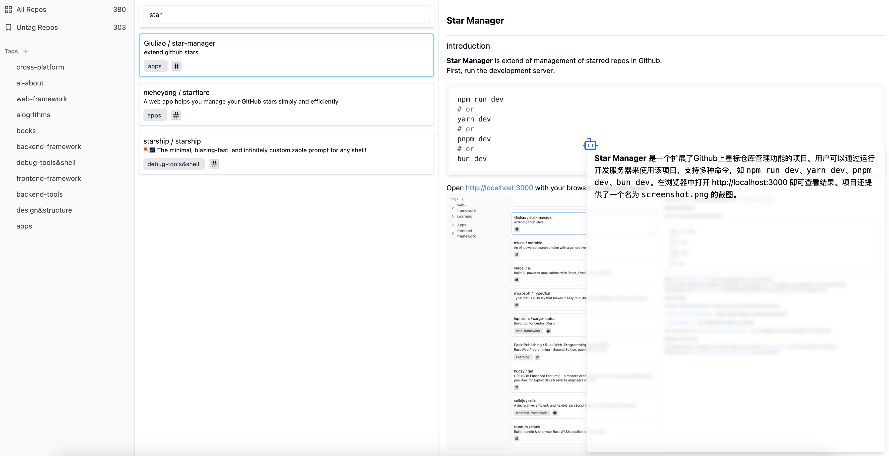

# Star Manager

## Introduction

__Star Manager__ is extend of management of starred repos in Github.

## Compare

Although there are already some of apps that have the same function. For reason I want to build new one is, none of them satisfied my need, lacking of tag management and data sync (a database). Here are the applications, I collected and compared,

|                | [__Starflare__](https://starflare.app/)     | [__Astralapp__](https://app.astralapp.com/dashboard?tag=webapp)    | [__Little Star__](https://www.littlestarcloud.com/)   | __Github__                           | __StarManager__   |
|--------------------|-------------------|-------------------|-------------------|--------------------------------------|-------------------|
| __Layout of apps__ | tags/list/content | tags/list/content | tags/list/content | group of repo\(above\) list\(below\) | tags/list/content |
| __Tags__          | custom tags       | custom tags       | custom tags       | create list                          | custom tags       |
| __Data Sync__      | x                 | ✅                 | ✅                 | ✅                                    | ✅                 |
| __Starred Repos__  | get all           | get all           | get all           | pagination                           | get all           |
| __Show Trending__  | x                 | x                 | ✅                 | ✅                                    | x                 |
| __Show Content__   | ✅                 | x                 | x                 | x                                    | ✅                 |
| __Export Tags__    | ✅                 | x                 | x                 | x                                    | x                 |
| __Notes Repos__    | x                 | ✅                 | x                 | x                                    | x                 |
|__AI Support__  | x                  | x                | x                 | x                                    | ✅               |

Astralapp and Little Star is not free. I like Starflare, I think the UI is pretty good, but it dose not support data sync and is wrote by Vue2, the code repos is [here](https://github.com/nieheyong/starflare). So here comes StarManager, and I also add AI for abstracting README. All of the functions are free.

## Preview

